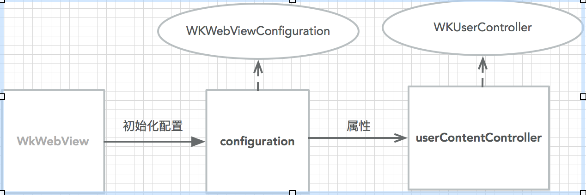

# WKWebView

## WKWebView 有两个代理

- [x] WKNavigationDelegate
- [x] WKUIDelegate


 [WKNavigationDelegate](#1-WKNavigationDelegate)

 [WKUIDelegate](#WKUIDelegate)

 ### 1 WKNavigationDelegate

请求开始前，会先调用此代理方法

```
- (void)webView:(WKWebView *)webView decidePolicyForNavigationAction:(WKNavigationAction *)navigationAction decisionHandler:(void (^)(WKNavigationActionPolicy))decisionHandler{

	decisionHandler(WKNavigationActionPolicyAllow);
} 
```

在响应完成时，会回调此方法

如果设置为不允许响应，web内容就不会传过来
```
- (void)webView:(WKWebView *)webView
decidePolicyForNavigationResponse:(WKNavigationResponse *)navigationResponse
decisionHandler:(void (^)(WKNavigationResponsePolicy))decisionHandler{

}
```

开始导航跳转时会回调
```
- (void)webView:(WKWebView *)webView didStartProvisionalNavigation:(null_unspecified WKNavigation *)navigation {

}

```

接收到重定向时会回调

```
- (void)webView:(WKWebView *)webView
didReceiveServerRedirectForProvisionalNavigation:(null_unspecified WKNavigation *)navigation {

}

```
导航失败时会回调

```
- (void)webView:(WKWebView *)webView
didFailProvisionalNavigation:(null_unspecified WKNavigation *)navigation withError:(NSError *)error{


}
```

当内容开始返回时调用
```
- (void)webView:(WKWebView *)webView didCommitNavigation:(null_unspecified WKNavigation *)navigation{

}
```

页面加载完成
```
- (void)webView:(WKWebView *)webView didFinishNavigation:(null_unspecified WKNavigation *)navigation{

}
```


导航失败时会回调
```

- (void)webView:(WKWebView *)webView didFailNavigation:
(null_unspecified WKNavigation *)navigation withError:(NSError *)error{

}
```

对于HTTPS的都会触发此代理，如果不要求验证，传默认就行
如果需要证书验证，与使用AFN进行HTTPS证书验证是一样的

```
- (void)webView:(WKWebView *)webView didReceiveAuthenticationChallenge:
(NSURLAuthenticationChallenge *)challenge completionHandler:
(void (^)(NSURLSessionAuthChallengeDisposition disposition,
          NSURLCredential *__nullable credential))completionHandler{
completionHandler(NSURLSessionAuthChallengePerformDefaultHandling, nil);
          }

```


9.0才能使用，web内容处理中断时会触发
```
- (void)webViewWebContentProcessDidTerminate:(WKWebView *)webView{

}
```

# WKUIDelegate

WKUIDelegate 协议包含一些函数用来监听 web JS 想要显示 alert 或 confirm 时触发。我们如果在 WKWebView 中加载一个 web 并且想要 web JS 的 alert 或 confirm 正常弹出


JS端调用alert函数时，会触发此代理方法

```

- (void)webView:(WKWebView *)webView runJavaScriptAlertPanelWithMessage:(NSString *)message
initiatedByFrame:(WKFrameInfo *)frame completionHandler:(void (^)(void))completionHandler{
 UIAlertController *alert = [UIAlertController alertControllerWithTitle:@"alert" message:message
                                                            preferredStyle:UIAlertControllerStyleAlert];
    [alert addAction:[UIAlertAction actionWithTitle:@"确定" style:
                      UIAlertActionStyleDefault handler:^(UIAlertAction * _Nonnull action) {
                          completionHandler();
                      }]];
    
    [self presentViewController:alert animated:YES completion:NULL];
}
```

JS端调用confirm函数时，会触发此方法
```
- (void)webView:(WKWebView *)webView
runJavaScriptConfirmPanelWithMessage:(NSString *)message
initiatedByFrame:(WKFrameInfo *)frame
completionHandler:(void (^)(BOOL result))completionHandler{
UIAlertController *alert = [UIAlertController alertControllerWithTitle:
                                @"confirm" message:@"JS调用confirm"
                                                            preferredStyle:UIAlertControllerStyleAlert];
    [alert addAction:[UIAlertAction actionWithTitle:@"确定"
                                              style:UIAlertActionStyleDefault handler:^(UIAlertAction * _Nonnull action){
                                                  completionHandler(YES);
                                              }]];
    [alert addAction:[UIAlertAction actionWithTitle:@"取消"
                                              style:UIAlertActionStyleCancel handler:^(UIAlertAction * _Nonnull action) {
                                                  completionHandler(NO);
                                              }]];
    [self presentViewController:alert animated:YES completion:NULL];

}

```

JS端调用prompt函数时，会触发此方法

```
- (void)webView:(WKWebView *)webView
runJavaScriptTextInputPanelWithPrompt:(NSString *)prompt
    defaultText:(nullable NSString *)defaultText
initiatedByFrame:(WKFrameInfo *)frame
completionHandler:(void (^)(NSString * __nullable result))completionHandler{

	UIAlertController *alert = [UIAlertController alertControllerWithTitle:
                                    prompt message:defaultText
                                                                preferredStyle:UIAlertControllerStyleAlert];
        [alert addTextFieldWithConfigurationHandler:^(UITextField * _Nonnull textField) {
            textField.textColor = [UIColor redColor];
        }];
        [alert addAction:[UIAlertAction actionWithTitle:@"确定"
                                                  style:UIAlertActionStyleDefault handler:^(UIAlertAction * _Nonnull action) {
                                                      completionHandler([[alert.textFields lastObject] text]);
                                                  }]];
        
        [self presentViewController:alert animated:YES completion:NULL];
}

```


## MessageHandler

MessageHandler 是继 Native 截获 JS 假请求后另一种 JS 调用 Native 的方法，该方法利用了 WKWebView 的新特性实现。对比截获假 Request 的方法来说，MessageHandler 传参数更加简单方便


MessageHandler 指什么？

 
WKUserContentController 类有一个方法:

```
- (void)addScriptMessageHandler:(id <WKScriptMessageHandler>)scriptMessageHandler name:(NSString *)name
```
该方法用来添加一个脚本处理器，可以在处理器内对 JS 脚本调用的方法做出处理，从而达到 JS 调用 Native 的目的


 WKUserContentController 类和 WKWebView 的关系




### WKScriptMessageHandler 协议

WKScriptMessageHandler 是脚本信息处理器协议，如果想让一个对象具有脚本信息处理能力就必须使其遵循该协议。

WKScriptMessageHandler 协议方法，在接收到脚本信息时触发
```
- (void)userContentController:(WKUserContentController *)userContentController didReceiveScriptMessage:(WKScriptMessage *)message {

	// message 有两个属性：name 和 body
	// body 相当于 JS 传递过来的参数
}
```


**参考文档:**

[1.WKWebView 那些坑](https://mp.weixin.qq.com/s/rhYKLIbXOsUJC_n6dt9UfA)

[2.WKWebView从入门到趟坑](http://www.10tiao.com/html/655/201612/2650215106/1.html)


js 调用原生 

```
window.webkit.messageHandlers.JsInterface.postMessage(ars);
```
原生调用js

```
[self.wkWebView evaluateJavaScript:jscript completionHandler:^(id object, NSError * _Nullable error) {
    }];
```


